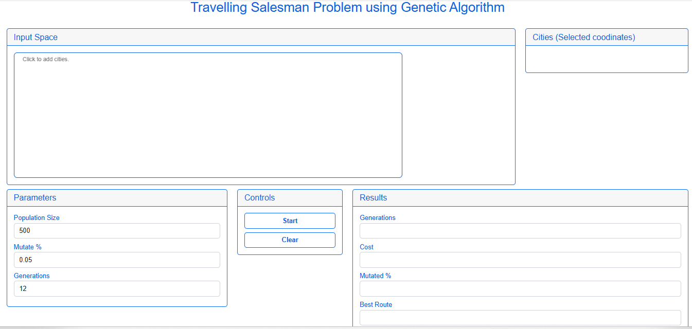
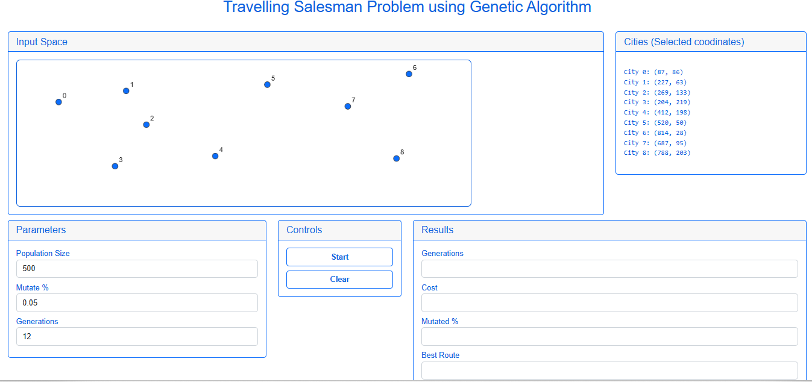
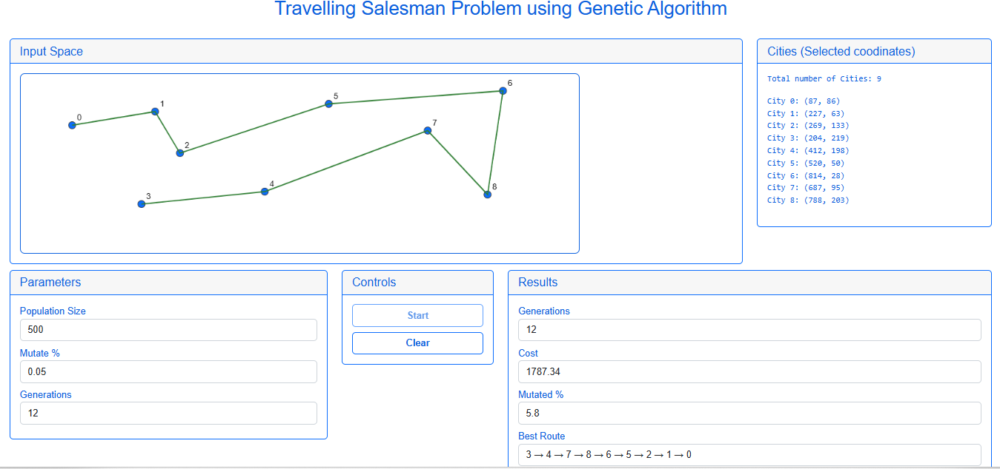
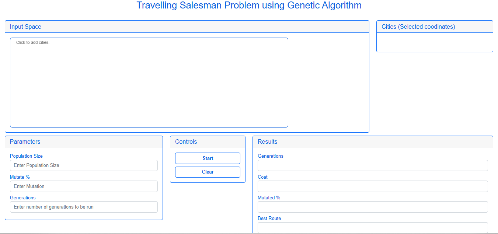

## Procedure
1. Enter Parameters for Population Size, Mutation Percentage and Generations.

2. Click on the Board Area name "Input Space" to add cities(Max 100 can be plotted).

3. Click Start to see result to the problem achieved using GA.

4. Click Clear and restart the experiment.
